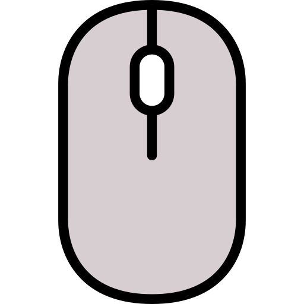

# AutoClicker for Games

A program for automating keyboard and mouse clicks in games with support for fullscreen mode. Written in Python using PyAutoGUI and tkinter.



## Features

1. **Spam** - automatically presses left mouse button, space and key 1 every 10 ms
2. **LMB** - automatically presses only the left mouse button every 10 ms
3. **Customizable binds** - ability to assign keys to enable/disable functions
4. **Fullscreen menu** - open/close menu by pressing the Insert key

## Requirements

- Python 3.7 or higher
- Libraries: pyautogui, keyboard, pillow

## Installation and Launch

### Option 1: Running the Python script

1. Clone the repository:
```bash
git clone https://github.com/your-username/AutoClickerPy.git
cd AutoClickerPy
```

2. Install dependencies:
```bash
pip install -r requirements.txt
```

3. Run the script:
```bash
python autoclicker.py
```

### Option 2: Using the ready-made EXE file

1. Download the latest version from the [Releases](https://github.com/your-username/AutoClickerPy/releases) section
2. Extract the archive and run `autoclicker.exe`

### Option 3: Creating your own EXE file

1. Install PyInstaller:
```bash
pip install pyinstaller
```

2. Create an EXE file:
```bash
pyinstaller --onefile --windowed --icon=icon.png autoclicker.py
```

3. The finished file will be available in the `dist` folder

## Usage

1. Launch the program (EXE file or Python script)
2. The menu is hidden at startup, press **Delete** to show/hide
3. Use the buttons in the interface to enable/disable functions or set up hotkeys
4. Default hotkeys:
   - **Delete** - show/hide menu
   - **F1** - enable/disable Spam function
   - **F2** - enable/disable LMB function

## Important to Know

- Administrator rights may be required for the keyboard library to work
- The auto-clicker works on top of all windows, including fullscreen games
- Functions work even with the menu hidden
- Configured binds only work during the current session (not saved)

## Warning

Using auto-clickers may violate the rules of some games and lead to account blocking. Use at your own risk.

## License

MIT

## Author

Your Name 